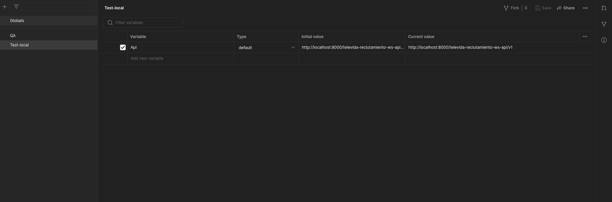

# README #

Proyecto de evaluación práctica para desarrolladores de nivel medio.
## Tecnología
    -> Java 8
    -> Maven
    -> GIT
    -> Docker
    -> MySql
    -> Tomcat
    -> Hibernate
    -> JPA 2
## Herramientas
    -> Git Bash o Source Tree
    -> Editor de texto (VSCode)
    -> Apache NetBeans IDE 16
    -> Diagrams.net App google 
    -> MySql Workbench
    -> Postman 

## Temario

1. Control de versionamiento GIT (Bitbucket)
2. Docker, docker compose (administración y creación de imagenes, contenedores, orquestación, etc)
3. Maven (Configuración de settings.xml, instalación de dependencias via comando, configuraciones de servidores, configuración de tomcat)
4. Comprensión de diagramas (UML) de clases, despliegue
5. Base de datos MYSQL (DDL, DML)
6. Nociones sobre Patrones de diseño
7. Programación en capas (datos, negocio, presentación)
8. Implemetación de componentes y librerias de JAVA
9. Test unitarios (Junit)
10. Documentación técnica de APIs (Swagger)
11. Postman (Colecciones, ambientes, variables, etc)

### 1. Control de versionamiento GIT (Bitbucket)
1. Clonar el repositorio [reclutamiento](https://bitbucket.org/televida/televida-middle-dev/src/master/)
2. Crear un repositorio en su sistema de versionamiento (gitlab, github, etc)
3. Crear la rama master y subir sus cambios
4. Trabajar en su repositorio y publicar commits 
5. Al finalizar las pruebas subir sus cambios
6. Enviar su repositorio publico al evaluador

### 2. Docker, docker compose (administración y creación de imagenes, contenedores, orquestación, etc)

1. Instalación de [docker](https://www.docker.com/get-started/) y [docker compose](https://docs.docker.com/compose/install/)
2. Crear la imagen de tomcat con el archivo [Dockerfile](tomcat/Dockerfile) en la carpeta [tomcat](tomcat), ejecutando el comando siguiente:
```
docker build -t televida-tomcat:9.0.36 .
```

#### Construir el ambiente de desarrollo 
1. Ingresar a la carpeta [environment](environment)
2. Ejecutar el siguiente comando
```
docker-compose up -d
```

3. Otros comandos de docker
```
# Crear un contenedor de tomcat para test
docker run -i -p 9000:8080 --name tomcat-dummy televida-tomcat:9.0.36
```
3. Prueba de tomcat en el navegador [http://localhost:8000](http://localhost:8000)  


4. Prueba del gestor de base de datos, en su RDBMS favorito (dbeaver, mysql workbench, etc) realice lo siguiente
    - Crear una nueva conexión
    - Agregar las credenciales que se configuró en el archivo [environment/docker-compose.yml](environment/docker-compose.yml) 
        * Servidor: localhost
        * Puerto: 33060
        * Usuario: root
        * Password: test

    

    - Al ingresar le debe mostrar una ventana similar a la siguiente:

    


### 3. Maven (Configuración de settings.xml, instalación de dependencias via comando, configuraciones de servidores, configuración de tomcat)
1. Instalación de [MAVEN](https://maven.apache.org/download.cgi), version 3.6.3
2. Configuración de maven
    - settings.xml

```
<settings xmlns="http://maven.apache.org/SETTINGS/1.0.0"
          xmlns:xsi="http://www.w3.org/2001/XMLSchema-instance"
          xsi:schemaLocation="http://maven.apache.org/SETTINGS/1.0.0 https://maven.apache.org/xsd/settings-1.0.0.xsd">

    <localRepository>${user.home}/.m2/repository</localRepository>
    <interactiveMode>true</interactiveMode>
    <offline>false</offline>
    
    <pluginGroups>
    </pluginGroups>

    <proxies>
    </proxies>

    <servers>
        <server>
            <id>TomcatServer</id>
            <username>tomcat</username>
            <password>tomcat</password>
        </server>
    </servers>

    <mirrors>
        <mirror>
            <id>google-maven-central</id>
            <name>Google Maven Central</name>
            <url>https://maven-central.storage.googleapis.com/repos/central/data/</url>
            <mirrorOf>central</mirrorOf>
        </mirror>   
        <mirror>
            <id>maven.central</id>
            <name>Maven - Repository</name>
            <url>https://repo.maven.apache.org/maven2/</url>
            <mirrorOf>central</mirrorOf>
        </mirror>
    </mirrors>

    <profiles>       
        <profile>
            <id>maven.central</id>
            <repositories>
                <repository>
                    <id>maven.central</id>
                    <url>https://repo.maven.apache.org/maven2/</url>
                    <releases>
                        <enabled>true</enabled>
                    </releases>
                    <snapshots>
                        <enabled>false</enabled>
                    </snapshots>
                </repository>
                <repository>
                    <id>archiva.snapshots</id>
                    <url>https://repo.maven.apache.org/maven2/</url>
                    <releases>
                        <enabled>false</enabled>
                    </releases>
                    <snapshots>
                        <enabled>true</enabled>
                    </snapshots>
                </repository>
            </repositories>
        </profile>
    </profiles>
</settings>
```
3. Instalar una dependencia manualmente en maven 
```
mvn install:install-file -Dfile=mimepull-1.9.3.jar -DgroupId=org.jvnet.mimepull -DartifactId=mimepull -Dversion=1.9.3 -Dpackaging=jar
```
4. [maven central repository](https://mvnrepository.com/repos/central)


5. Instalar manualmente las dependencias de la carpeta [dependencies](dependencies/) en el siguiente orden:
    1. [televida-integration-0.0.3-RELEASE](dependencies/televida-integration-0.0.3-RELEASE.jar)
    ```
    <dependency>
	    <groupId>biz.televida</groupId>
	    <artifactId>televida-integration</artifactId>
	    <version>0.0.3-RELEASE</version>
	</dependency>
    ```
    2. [televida-logging-0.0.2-RELEASE](dependencies/televida-logging-0.0.2-RELEASE.jar)
    ```
    <dependency>
	    <groupId>biz.televida</groupId>
	    <artifactId>televida-logging</artifactId>
	    <version>0.0.2-RELEASE</version>
	</dependency>
    ```
    3. [televida-utils-0.0.12-RELEASE](dependencies/televida-utils-0.0.12-RELEASE.jar)
    ```
    <dependency>
	    <groupId>biz.televida</groupId>
	    <artifactId>televida-utils</artifactId>
	    <version>0.0.12-RELEASE</version>
	</dependency>
    ```
    4. [televida-provider-0.0.11-RELEASE](dependencies/televida-provider-0.0.11-RELEASE.jar)
    ```
    <dependency>
        <groupId>biz.televida</groupId>
        <artifactId>televida-provider</artifactId>
        <version>0.0.11-RELEASE</version>
    </dependency>
    ```
    5. [multienv-maven-plugin-0.0.3.jar](dependencies/multienv-maven-plugin-0.0.3.jar)
    ```
    <dependency>
        <groupId>biz.televida.develop</groupId>
        <artifactId>multienv-maven-plugin</artifactId>
        <version>0.0.3</version>
    </dependency>
    ```

### 4. Comprensión de diagramas (UML) de clases, despliegue

#### Diagramas de clases

##### televida-provider


##### televida-reclutamiento-model

-  Tarea 1  
Realizar el diagrama de clases de los providers de la capa de **datos**


##### televida-reclutamiento-business
-  Tarea 2  
Realizar el diagrama de clases de servicios de la capa de **negocio**


-  Tarea 3  
Explicar el proposito del siguiente diagrama  


El propósito del diagrama es representar que componente necesita o proveé la implementación de una interfaz, en este caso:

**1)** El componente televida-reclutamiento-model proveé la implementación de una interfaz

**2)** El componente televida-reclutamiento-business requiere de una implementación, en este caso es que la provee el componente model, a su vez el componente business provee la implementación de una interfaz

**3)** El componente televida-reclutamiento-ws-api  requiere de una implementación, en este caso es que la provee el componente bussiness, a su vez el componente ws-api provee la implementación de una interfaz


* Los componentes se encuentran en la carpeta [layers](layers)

### 5. Base de datos MYSQL (DDL, DML)

1. Crear el esquema **reclutamiento** en su instancia de MySql
2. Ejecutar el script [reclutamiento.sql](commons/database/reclutamiento.sql) 
3. Analice el diagrama de Entidad Relación 
    -  Tarea 4   
    Crear y relacionar una tabla para llevar el registro de los pagos de cada suscripcion (mensual, trimestral, anual)

   
    
**Diagrama entidad relacion actualizado**


-  Tarea 5    
Dejar constancia de su codigo DDL 
<pre>
CREATE TABLE subscription_payments(
	subscription_payment_id INT PRIMARY KEY AUTO_INCREMENT,
	subscription_id INT,
	payment_date TIMESTAMP NULL,
	subscription_type ENUM('MENSUAL', 'TRIMESTRAL', 'ANUAL'),
	status INT NULL DEFAULT 1,
  	creation_date TIMESTAMP NULL DEFAULT CURRENT_TIMESTAMP,
  	change_date TIMESTAMP NULL DEFAULT CURRENT_TIMESTAMP on update CURRENT_TIMESTAMP,
  	created_by VARCHAR(255) NULL DEFAULT 'unknow',
  	changed_by VARCHAR(255) NULL DEFAULT 'unknow',
  	`version` INT NULL DEFAULT 0,
	FOREIGN KEY (subscription_id) REFERENCES subscription(subscription_id)
)
</pre>
### 6. Nociones sobre Patrones de diseño
-  Tarea 6  

Preguntas

1. ¿Para que se utilizan los patrones creacionales?
2. ¿Para que se utilizan los patrones estructurales?

**Se utilizan para facilitar la composición de clases y objetos en estructuras más grandes y complejas.**

3. ¿Para que se utilizan los patrones de comportamiento?
4. ¿En que escenario se utilizaría el patron de diseño singleton?

**R. Cuando se quiere una clase tenga una solo instancia y que se puede utilizar de manera global. Por ejemplo para tener una sola instancia de la conexion ala base de datos**

5. ¿En que escenario se utilizaría el patron de diseño estrategia?
6. ¿En que escenario se utilizaría el patron de diseño builder?

**R. Se utiliza cuando se quiere construir un objeto complejo paso a paso.**

7. ¿Cuál es el proposito de los DTOs?

**R. Sirven para encapsular un conjunto de datos y enviarlo a través de la red o entre capas de una aplicación.**

8. ¿Cuál es el proposito de los DAOs?
9. ¿Que se debe controlar al implementar el patrón singleton en un escenario multihilo?
10. ¿Expliqué que es un antipatron y porque evitar su uso?

**R. Un antipatron suele ser el abuso de algun patron o la mala implemetacion del mismo, se deben evitar porque generan complejidad innecesaria y se dificulta el entendimiento del código, lo que genera problemas a medida que el sistema evoluciona.**

### 7. Programación en capas (datos, negocio, presentación)


* El codigo de cada capa se encuentra en la carpeta [layers](layers)
#### Capa de datos
En Netbeans abrir la capa de datos [televida-reclutamiento-model](layers/televida-reclutamiento-model) 

-  Tarea 7

1. En el paquete **biz.televida.reclutamiento.model.entity** mapear la entidad de la tabla creada en la **tarea 5** con el nombre de SubscriptionPayments
2. Relacionar **(bajo las condiciones de una suscripción tiene muchos pagos y un pago pertenece a una suscripción)** las clases Subscription y SubscriptionPayments del paquete **biz.televida.reclutamiento.model.entity**
3. En el paquete **biz.televida.reclutamiento.model** de la carpeta **Test Packages** completar el ABC (Alta, Baja y Cambios) de las clases PlanProviderImpTest y SubscriptionProviderImpTest

#### Capa de negocios
En Netbeans abrir la capa de negocios [televida-reclutamiento-business](layers/televida-reclutamiento-business) 

-  Tarea 8  
1. Crear el DTO **SubscriptionPaymentsDto** con las propiedades de la entidad **SubscriptionPayments** de la capa de datos  
2. Crear el Converter para pasar de DTO a Entity y viceversa de la clase **SubscriptionPaymentsDto**  y **SubscriptionPayments**  
3. Modificar el DTO **SubscriptionDto** agregando una propiedad que liste los pagos de la suscripcion (**SubscriptionPaymentsDto**)  
4. Modificar el converter **SubscriptionConverter** para mapear el listado de **SubscriptionPaymentsDto**  
5. Crear las implementaciones de ABC del servicio **SubscriptionService** del paquete biz.televida.reclutamiento.business  
6. Crear la clase de Test para la clase **SubscriptionService** del paquete biz.televida.reclutamiento.business y testear cada metodo de la clase  

#### Capa de presentacion
En Netbeans abrir la capa de negocios [televida-reclutamiento-ws-api](layers/televida-reclutamiento-ws-api) 

-  Tarea 9    
* Los controladores se encuentran en el paquete **biz.televida.reclutamiento.ws.api.rest**  
1. Crear los metodos para registro, actualizacion y listado de elementos en la clase **PlanController**  
2. Crear la clase **SubscriptionController** y crear los metodos para registro, actualizacion y listado de elementos de la suscripción  
3. Al finalizar en la raiz del proyecto [televida-reclutamiento-ws-api](layers/televida-reclutamiento-ws-api/) revisar el archivo [readme](layers/televida-reclutamiento-ws-api/readme.md) para montar el war en el tomcat creado en el ambiente de desarrollo.  

### 8. Implemetación de componentes y librerias de JAVA
 

### 9. Test unitarios (Junit)
-  Tarea 10     
Revisión de tests (Evaluador)  
### 10. Documentación técnica de APIs (Swagger)
* Puede probar sus servicios de swagger http://localhost:8000/televida-reclutamiento-ws-api/swagger-ui/  

-  Tarea 11         
Colocar capturas de pantalla de swagger de cada servicio

**Listar planes**


**Crear plan**


**Actualizar plan**


**Listar suscripciones**


**Crear suscripcion**


**Actualizar suscripcion**


### 11. Postman (Colecciones, ambientes, variables, etc)  
-  Tarea 12         

1. Crear el workspace TELEVIDA


2. Migrar servicios de swagger a postman

**Listar planes**


**Crear plan**


**Actualizar plan**


**Listar suscripciones**


**Crear suscripcion**


**Actualizar suscripcion**


3. Configuracion de ambiente de pruebas y QA (Ficticio)


4. Creacion de variables globales para cada ambiente (test: http://localhost:8000/televida-reclutamiento-ws-api/v1/ y QA: http://test.televida.biz/televida-reclutamiento-ws-api/v1/)

**Test**


**QA**


5. Obtener capturas de pantalla 


# Issues
## Error dependencias
Error descarga automatica de la dependencia **spring-web**  
* Instalación manual, la  [spring-web-5.2.9.RELEASE.jar](dependencies).
```
<!-- https://mvnrepository.com/artifact/org.springframework/spring-web -->
<dependency>
    <groupId>org.springframework</groupId>
    <artifactId>spring-web</artifactId>
    <version>5.2.9.RELEASE</version>
</dependency>
```
